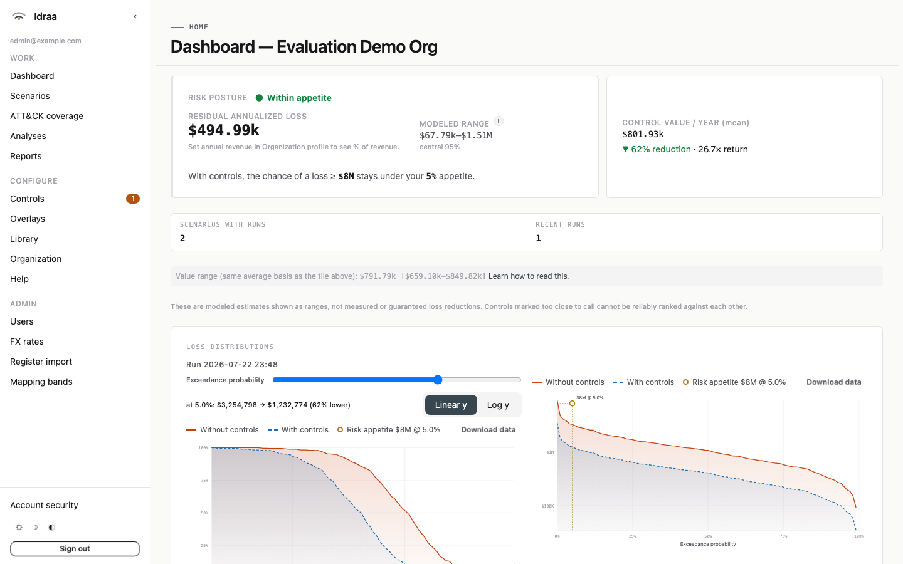
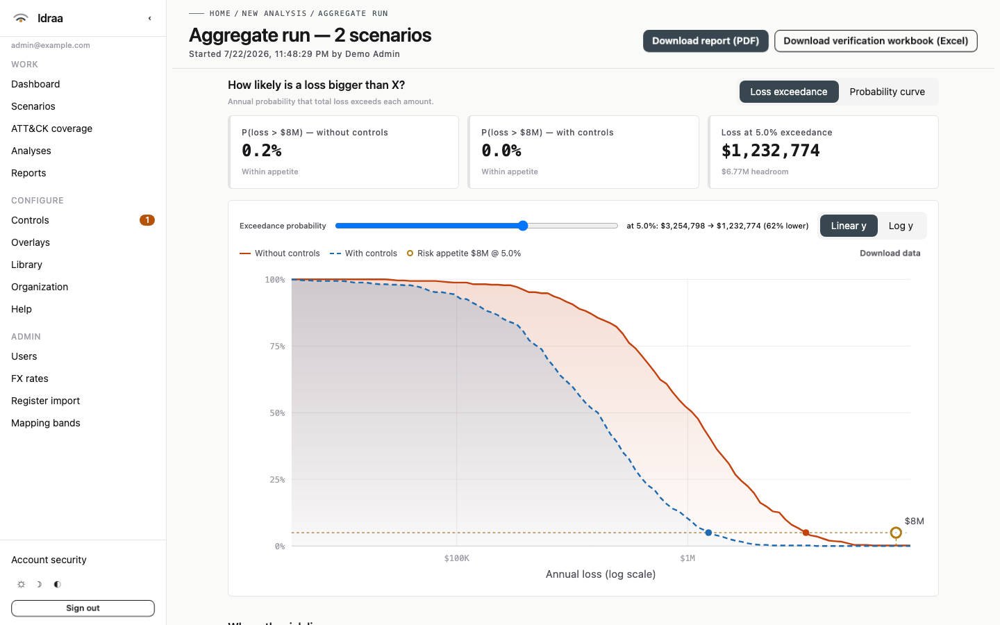
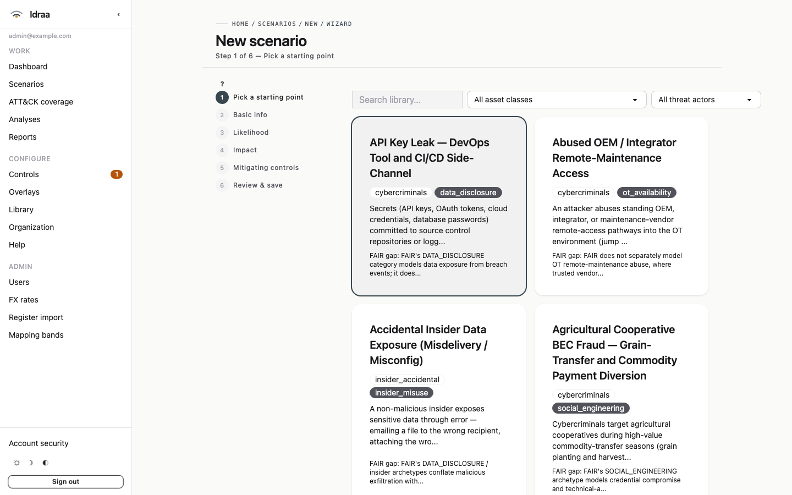

# Idraa

Quantitative cyber-risk analysis platform — FAIR methodology, control-aware modeling (FAIR-CAM), Monte Carlo simulation, financial impact analysis, and executive reporting.

**Status:** in production UAT on Fly.io; evaluation self-hosting supported via Docker Compose. See [ROADMAP.md](ROADMAP.md) and the [intro deck](https://yasirhamza.github.io/idraa).

## Screenshots

| Dashboard | Loss exceedance | Scenario wizard |
| --- | --- | --- |
| [](docs/readme/dashboard-2026-07.png) | [](docs/readme/loss-exceedance-2026-07.png) | [](docs/readme/wizard-2026-07.png) |

## What it does

- **Scenarios** — FAIR-grounded risk scenarios (Threat / Asset / Method / Effect), authored via a guided SME-elicitation wizard, cloned from the curated library, or imported from CSV/JSON.
- **Library** — 102 curated scenario archetypes with primary-cited FAIR distributions (IRIS sector anchors), three-tier provenance, and a per-org override layer with versioning + audit.
- **Controls** — FAIR-CAM control modeling with sub-function assignments, framework crosswalks (NIST CSF, CIS v8, MITRE ATT&CK), and a curated control library.
- **Analysis** — native Monte Carlo engine (single-scenario and portfolio AGGREGATE runs), full sample persistence, VaR/ES tail ladder, loss-exceedance curves, and per-control Shapley attribution.
- **Reporting** — executive web dashboards and tiered PDF reports with snapshot provenance; audited CSV/JSON exports.
- **Platform** — session auth with passkey/TOTP MFA, RBAC (analyst / reviewer / admin), a first-class audit log, and a mobile-responsive UI.

This is the v3 ground-up rebuild, succeeding a Streamlit prototype (v1 RiskFlux) that validated the FAIR math but whose UI didn't survive, and an unfinished Node/Remix/MongoDB attempt (v2 RiskFlow). The validated `fair_cam` engine from v1 carries forward as v3's calculation core.

## Try it (evaluation)

```bash
git clone https://github.com/yasirhamza/idraa && cd idraa
cp .env.example .env   # then set SESSION_SECRET + MFA_ENCRYPTION_KEY (see file)
docker compose up -d --build
open http://localhost:8000/setup   # first-run admin creation
```

That's a Postgres + app stack: the `app` container runs `alembic upgrade head` before it starts serving, and `docker-compose.yml` reads `.env` via `env_file:` — every uncommented line there lands in the app's environment (see `.env.example` for which vars are safe to leave commented). If this instance is reachable from anywhere other than your own machine, set `ENVIRONMENT=prod`, a real `WEBAUTHN_RP_ID` + `WEBAUTHN_ORIGINS` (passkeys are bound to the RP-ID for good — get it right before the first enrollment), and put a TLS-terminating reverse proxy in front of it with `FORWARDED_ALLOW_IPS` set to the proxy's address so uvicorn trusts its forwarded headers. The current license permits this kind of evaluation self-hosting; it does not permit other use (see License below).

## How it's built

**Stack:** FastAPI + Jinja2 + HTMX/Alpine for the UI (no JS build step), SQLAlchemy 2 + Alembic for persistence, SQLite for dev/test and Postgres for compose/production.

**Engine:** a native Monte Carlo simulator drives FAIR-CAM Boolean control composition (with κ meta-reliability coupling for meta-controls), per-control Shapley and if-removed attribution, and weight-robustness ensembles that express FAIR-CAM's composition-weight uncertainty as ranges rather than a single point estimate. `fair_cam` is first-party and is the only place FAIR math is computed — the app layer never re-derives it.

**Verification discipline:** every scenario ships an independent in-Excel verification workbook (LET/RANDARRAY dynamic-array Monte Carlo) that reproduces sampling and ALE from the same inputs, hand-derived math anchors pin the engine's statistical assumptions in tests, and a pre-push local gate (ruff + mypy + pytest) mirrors what CI would run.

## Configuration

Full reference: [`.env.example`](.env.example) (copy to `.env`; every variable there is either active or ships commented out with an example value — uncomment what you set).

| Variable | Purpose |
| --- | --- |
| `SESSION_SECRET` | Cookie-signing secret. Required; compose refuses to start without it; prod requires 32+ characters. |
| `ENVIRONMENT` | `dev` \| `prod` \| `test`. `prod` turns on secret/WebAuthn/MFA-key boot hardening — set it for any instance reachable over a network. |
| `DATABASE_URL` | SQLAlchemy DSN. Ignored under `docker compose` (compose pins the bundled Postgres service); applies to non-compose runs. |
| `AUTH_MFA_POLICY` | `required` (default) or `optional` — whether every user must enroll a second factor at first login. |
| `MFA_ENCRYPTION_KEY` | Encrypts stored TOTP secrets at rest. Falls back to a `SESSION_SECRET`-derived key in dev/test; prod refuses to boot without a distinct 32+ character value. |
| `WEBAUTHN_RP_ID` | Passkey relying-party ID — your registrable domain, no scheme/port. Permanently binds enrolled passkeys; prod refuses to boot on the `localhost` default. |
| `WEBAUTHN_ORIGINS` | Comma-separated `https://` origins that must match `WEBAUTHN_RP_ID`'s host (or a subdomain). |
| `FORWARDED_ALLOW_IPS` | IP address(es) of your reverse proxy, so uvicorn trusts its forwarded headers. Set it to the proxy's actual address, never `*` — a proxy appends to `X-Forwarded-For` rather than replacing it, so `*` (which trusts the leftmost entry) lets any client that can reach the app port directly forge a trusted "client IP". |

## Development

Prerequisites: Python 3.11+, [uv](https://docs.astral.sh/uv/), Docker Desktop.

```bash
# First-time setup — BOTH pre-commit stages are required
uv sync --extra dev
uv run playwright install chromium
uv run pre-commit install                       # per-commit lints
uv run pre-commit install --hook-type pre-push  # branch gates + local verification gate

# Local verification gate (a fast local mirror of the CI gate; runs on push):
# ruff check + ruff format --check + mypy + fast pytest. Runs automatically
# on `git push`; run manually with:
uv run python scripts/run_local_gate.py

# Individual tasks
uv run python -m idraa.tasks lint
uv run python -m idraa.tasks typecheck
uv run python -m idraa.tasks test
uv run python -m idraa.tasks e2e

# Run the dev server
docker compose up -d --build
curl http://localhost:8000/healthz
docker compose down -v

# Database migrations
uv run alembic upgrade head
```

Notes on cross-platform setup, operational envelope (VM size, MC iteration caps, memory patterns), and collaboration conventions live in [`CLAUDE.md`](CLAUDE.md).

## License

**Source-visible, all rights reserved.** No license is currently granted: you may
read this code, but you may not use, copy, modify, or redistribute it. A license
will be chosen at product launch. Evaluation self-hosting (running your own instance to assess the product) is welcome; any other use needs a license grant.

## Trademarks

FAIR™ and FAIR-CAM™ (Factor Analysis of Information Risk / FAIR Controls
Analytics Model) are trademarks of the FAIR Institute; Open FAIR™ is a trademark
of The Open Group. Idraa implements these published methodologies and is **not
affiliated with, sponsored by, or endorsed by** the FAIR Institute or The Open
Group. References to the standards are nominative — they describe what the
software implements.
